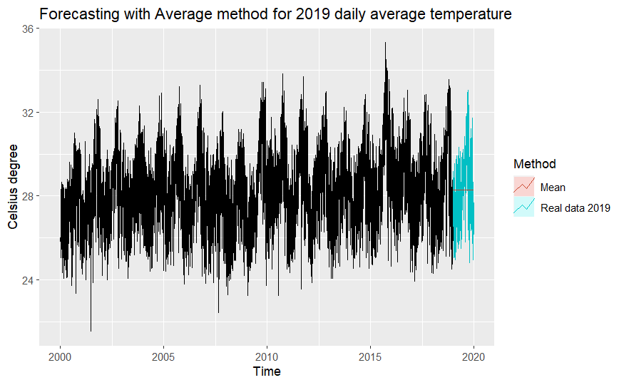

```{r setup, include=FALSE}
knitr::opts_chunk$set(echo = TRUE)
```

# Abstract

Forecasting the daily temperature is one of the most practical and widespread applications of forecasting techniques. In this paper, the authors are interested in predicting the average daily temperature in Manaus, Brazil. Basic forecasting methods and models are used to exploit historical data and other weather components to produce forecasts. These data come from conventional meteorological stations of the National Institute of Meteorology (INMET) distributed in the Brazilian territory from 1961 to 2019. Numerical results show that regression model with the relationship between temperature and other weather components, or dynamic regression models, perform well on this forecasting task.

# 1. Executive Summary

Climate change has been influencing the temperature at different areas all around the world. The rise in temperature (global warming) causes changes in natural conditions and leads to extreme phenomena which impact humans' lives negatively [1]. Forecasting daily temperature is of paramount importance since this information is used widely by people, it has meaningful effect on many fields such as industry, energy, and agriculture [2][3]. Accurate temperature forecast helps increase the effectiveness of energy consumption [4], predict other meteorological variables and weather components [5][6], and drive proper decisions on making plans for activities, energy policy, and business development [7]. Therefore, the purpose of this paper is to apply basic methods to forecast daily average temperature based on historical data of daily temperature and other weather components in Manaus, Brazil. Later on, the model might be optimized to produce precise forecasts of daily temperature in other cities of Brazil, the South America area, and possibly worldwide.

Basic methods and models that are used in this project including: bench marking methods of forecasting, decomposition (STL), exponential smoothing, time-series regression, ARIMA, dynamic regression models. Mentioned models are used independently to capture patterns and produce predictions.

To evaluate the performances of each model, we use the daily data from conventional meteorological stations of the National Institute of Meteorology (INMET) distributed in the Brazilian territory. Data from 1961 to 2019 are separated into training set and testing set.

Going through the project, we found out that the daily temperature can be predicted well with values of other weather components through the regression model. Dynamic regression models also perform precisely in this task by capturing all patterns including seasonality and trends.

The paper is organized as follows. Section 2 introduces what we did with the original data before applying forecasting approaches. Previous studies on the same topic are presented in Section 3. Section 4 lists all forecasting methods that are used in this project with explanation. Section 5 and 6 go through our coding process to produce prediction, before coming to our findings and conclusion with some future research directions in Section 7.

# 2. About the Data

## 2.1 Data collection process

To serve the purpose of forecasting daily temperature, we first chose to collect data from any certain area or city. After scanning through well-known sources, we stopped by the Brazil Weather, Conventional Stations (1961-2019) dataset on Kaggle [Appendix 1].

We went through its license and permission for users before downloading the dataset and unzipping to explore the data further.

## 2.2 Data background

It is meteorological data observed in conventional meteorological stations of the National Institute of Meteorology - INMET, from 1961 to 2019. The data is recorded in Portuguese, with 18 values (columns):

-   Estacao - Weather station code

-   Data - Date (dd/MM/YYYY)

-   Hora - Hour (%H%M)

-   Precipitacao - Precipitation (mm)

-   TempBulboSeco - Dry bulb temperature (ºC)

-   TempBulboUmido - Wet bulb temperature(ºC)

-   TempMaxima - Maximum temperature (ºC)

-   TempMinima - Minimum temperature (ºC)

-   UmidadeRelativa - Relative humidity (%)

-   PressaoAtmEstacao - Station Atmospheric Pressure (mbar)

-   PressaoAtmMar - Atmospheric pressure at sea level (mbar)

-   DirecaoVento - Wind Direction

-   VelocidadeVento - Wind speed(m/s)

-   Insolacao - Insolation (hs)

-   Nebulosidade - Cloudiness (tenths)

-   Evaporacao Piche - Piche Evaporation (mm)

-   Temp Comp Media - Average Compensated Temperature (ºC)

-   Umidade Relativa Media - Average Relative Humidity (%)

-   Velocidade do Vento Media - Average Wind Speed (mps)

It is measured by 265 stations located all around the Brazilian territory.

There are 3 files in this dataset, which contain:

-   Observations from different stations

-   Stations' codes and information

-   Wind direction codes and information

To serve the forecasting purpose, we used observations from "conventional_weather_stations_inmet_brazil_1961_2019.csv" file only.

## 2.3 Data pre-processing

The original data is enormous. There are 12,251,335 rows (observations) in total. This is because observations:

-   Come from 265 stations.

-   Are measured 3 times per day at 0:00, 12:00, and 18:00.

-   Are recorded daily from 01/01/1961 to 31/12/2019.

Our first task in the project was pre-processing - or cleaning - the data to choose an appropriate set of data which are insightful, clean and exploitable. This stage of the project was conducted in Python language (version 3.8) on Jupyter Notebook in PyCharm IDE (version 2020.3.4), with the aid from Anaconda (anaconda3) in building a virtual environment [Appendix 2].

The process includes:

2.3.1 Read and summary data from source's CSV file.

2.3.2 Choose data from 1 specific station (city) to perform further steps.

2.3.3 Translate properties into English.

2.3.4 Choose interpretable properties ('Precipitation', 'Humidity', 'Atmospheric_pressure', 'Wind_speed', 'Cloudiness', 'Evaporation_piche') and time period (from 2000).

2.3.5 Deal with missing data by filling values from the same time frame from 1 day before or after.

2.3.6 Calculate daily average values from 3 measures per day.

2.3.7 Standardize yearly data by removing the leap-year effect (29th of February).

At this stage, the data contains 7,300 observations (rows) from 01/01/2000 to 31/12/2019. Each observation includes daily average: temperature (Celsius degree), Humidity, Atmospheric pressure, Wind speed, and Cloudiness.

2.3.8 Separate training data (from 2000 to 2018) and test data (2019).

Training data: 6,935 observations from 01/01/2000 to 31/12/2018.

Testing data: 365 observations from 01/01/2019 to 31/12/2019.

2.3.9 Input the data to RStudio and convert it to time-series objects.

Train data:

```{r echo=TRUE, fig.show='hide'}
data_to2018 = read.csv(file = 'data_pre-processed/data_daily_avg_from2000_365_withdate_2000_to_2018.csv')
rownames(data_to2018) = data_to2018$Date
data_to2018$Date = NULL
str(data_to2018)
summary(data_to2018)
```

```{r echo=TRUE, fig.show='hide'}
data_to2018_ts = ts(data_to2018, start=c(2000, 1), frequency = 365)
```

Test data:

```{r echo=TRUE, fig.show='hide'}
data_2019 = read.csv(file = 'data_pre-processed/data_daily_avg_from2000_365_withdate_2019.csv')
rownames(data_2019) = data_2019$Date
data_2019$Date = NULL
str(data_2019)
summary(data_2019)
```

```{r echo=TRUE, fig.show='hide'}
data_2019_ts = ts(data_2019, start=c(2019, 1), frequency = 365)
```

# 3. Individual forecasting models used

## 3.1 Bench marking methods

### 3.1.1 Average method

The forecasts of all future values are equal to the average (or \"mean\") of the historical data.

### 3.1.2 Naïve method

We simply set all forecasts to be the value of the last observation.

### 3.1.3 Seasonal naïve method

We set each forecast to be equal to the last observed value from the same season (the same day of the previous year).

### 3.1.4 Drift method

A variation on the naïve method is to allow the forecasts to increase or decrease over time, where the amount of change over time (called the **drift**) is set to be the average change seen in the historical data.

## 3.2 Time series regression

We forecast the time series of interest **daily average temperature** assuming that it has a linear relationship with other time series: **daily humidity, daily atmospheric pressure, daily wind speed, daily cloudiness**.

In this case, we performed **Ex-ante forecasts,** which are those that are made using only the information that is available in advance. This forecasts for the daily average temperature in certain days, should only use information that was available *up to and including* the interested day.

## 3.3 Time series decomposition with STL

We decompose a time series into components: a trend-cycle component, a seasonal component, and a remainder component (containing anything else in the time series).

STL is a versatile and robust method for decomposing time series. STL is an acronym for "Seasonal and Trend decomposition using Loess", while Loess is a method for estimating nonlinear relationships. The two main parameters to be chosen when using STL are the trend-cycle window (t.window) and the seasonal window (s.window). These control how rapidly the trend-cycle and seasonal components can change.

## 3.4 Exponential smoothing with ETS

Forecasts produced using exponential smoothing methods are weighted averages of past observations, with the weights decaying exponentially as the observations get older. In other words, the more recent the observation the higher the associated weight.

We used the ets() function in R to estimate the model parameters and returns information about the fitted model. By default it uses the AICc to select an appropriate model, although other information criteria can be selected.

## 3.5 Auto Regressive Integrated Moving Average (ARIMA) models

**AR:** In an autoregression model, we forecast the variable of interest using a linear combination of past values of the variable. The term autoregression indicates that it is a regression of the variable against itself.

**I:** Differencing can help stabilise the mean of a time series by removing changes in the level of a time series, and therefore eliminating (or reducing) trend and seasonality.

**MA:** Rather than using past values of the forecast variable in a regression, a moving average model uses past forecast errors in a regression-like model.

The `auto.arima()` function uses `nsdiffs()` to determine D (the number of seasonal differences to use), and `ndiffs()` to determine d (the number of ordinary differences to use). The selection of the other model parameters (p, q, P and Q) are all determined by minimizing the AICc, as with non-seasonal ARIMA models.

## 3.6 Dynamic regression models with ARIMA errors

We consider how to extend ARIMA models in order to allow other information to be included in the models. This allows the errors from a regression to contain autocorrelation. Only the ARIMA model errors are assumed to be white noise.

To forecast using a regression model with ARIMA errors, we need to forecast the regression part of the model and the ARIMA part of the model, and combine the results. As with ordinary regression models, in order to obtain forecasts we first need to forecast the predictors.

## 3.7 Dynamic harmonic regression

When there are long seasonal periods, a dynamic regression with Fourier terms is often better than other models. A harmonic regression approach is where the seasonal pattern is modelled using Fourier terms with short-term time series dynamics handled by an ARMA error.

# 4. Forecasting results analysis

## 4.1 Patterns from the data set

### 4.1.1 Plot the data set with daily average temperature and other daily weather components:

\newline

Daily data from 2000 to 2018 has some slow trends and clear seasonality.

Atmospheric pressure and wind speed have small margin of fluctuation, except some obvious outliers for unknown reasons.

Average temperature reflects clear seasons through time in a year: lowest at the beginning of a year, increases gradually to the peak at later half of the middle of the year, then decreases as the time moving to the end of the year. Daily average temperature has been slightly increased (slightly upward trend) through 19 observed years in the data set.

Humidity seems to have reverse patterns in comparison with average temperature, with a slightly downward trend, and this component reaches the lowest when the average temperature is highest and vice versa.

Cloudiness has similar trend and seasonal patterns with humidity.

### 4.1.2 Explore seasonal patterns with seasonal plot by year:

\newline

The yearly seasonal plot of 365 days shows the seasonality of daily average temperature more clearly. In Manaus, daily temperature appears to be highest (warmest) around late August and in September, while the weather is coldest around late January and in February.

Daily temperature in this city increases gradually from late February to September, before falling down slowly again from late September to February of the next year.

### 4.1.3 Explore relationships between variables with scatterplot matrices

\newline

With the interest variable as average temperature (Avg_temp), Humidity and Cloudiness have more apparent impact on it than Atmospheric pressure and Wind speed.

With the correlation coefficients between Avg_temp and Humidity is -0.879; Avg_temp and Cloudiness is -0.620, we can say that these two pairs of variables have negative relationship. This matches with what we have observed from plotting the data in 5.1.1.

Atmospheric pressure and wind speed have relatively small effect on average temperature, with the coefficients are -0.205 and 0.285 respectively.

### 4.1.4 Explore autocorrelation in the dataset

\newline

We use r~i~ to represent the autocorrelation coefficient at lag i.

In this ACF graph:

-   The smaller the i (lag) is, the higher the r~i~. This shows a strong effect of daily temperature to the next-day temperature.

-   r~365~ is higher than for other lags. This is due to the seasonal pattern in the data: similar traits of temperature repeat after 1 year, or 365 days.

-   Around lag 240, r~i~ is more negative than other lag because the the daily temperature reaches its peak from trough or trough from peak after around 7-8 months (biggest difference).

-   From lag 366 to lag 730, the ACF graph is similar to the one from 0 to 365 due to the yearly seasonality pattern of the data set.

### 4.1.5 Perform time-series decomposition

\newline

We applied STL decomposition method to exhibit patterns of the data more clearly in terms of Trend and Seasonality. As displayed in the STL decomposition result plot, the daily average temperature of Manaus has an upward trend in general, with a drop in around 2009 and the most obvious increase trend in temperature appeared in around 2016.

Meanwhile, the seasonality of daily average temperature is quite stable. In this project, the seasonality of temperature is vital for forecasting, so we will not use seasonally adjusted data.

## 4.2 Forecasting results by methods

All models are trained with data from 2000 to 2018.

Daily average temperature of 2019 are generated as a forecasting result to compare with the real 2019 measured data.

### 4.2.1 Bench marking methods

Simplest methods of forecasting are applied to forecast daily average temperature of 2019. We plotted the fitted values over real values of 2019 to make the comparison between forecasting result and real data apparent.

Average, Naive and Drift methods are obviously ineffective to serve our purposes.

Seasonal naive method captures the seasonality of 2019, so basically it produces better predictions than the other three methods above. However, the forecasts are the same with 2018, so it is used only for "reference" purpose.

\newline

\newline

\newline

\newline

### 4.2.2 Time series regression

\newline

We can conduct the regression model between weather components (average value) in a day:

Temperature (^o^C) = 85.2951 - 0.1668 x Humidity - 0.0426 x Atmospheric pressure + 0.0138 x Wind speed - 0.1370 x Cloudiness

\newline

Based on the graph, we can say that for a simple approach, forecasting values produced by applying the formula above is quite good. However, temperature in 2019 appeared to be higher than usual (from 2000 to 2018 - values used to construct the regression formula), so there are differences between fitted values and real values.

\newline

### 4.2.3 Decomposition with STL

Applying STL decomposition to forecast with the random walk method produces better fitted values than the ETS method. However, the prediction interval from ETS method is smaller and more reliable.

\newline

\newline

### 4.2.4 Exponential smoothing with ETS

The ets() function can not handle this data with frequency 365. Because the seasonality is ignored in the trained model, the model ETS(M, N, N) has:

-   Errors: Multiplicative

-   Trend: None

-   Seasonal: None

\newline

Hence, the model produces a poor forecasting result.

\newline

Since the frequency of this data set is 365, it is too high to apply other exponential smoothing approaches such as Holt-Winters' seasonal or damped.

### 4.2.5 ARIMA

We used the auto.arima() function to find the best ARIMA model for the data set. In this case, the model is ARIMA(3, 1, 3).

\newline

However, the model produces a poor forecasting result:

\newline

This is because the auto.arima() function can only handle seasonal period up to 350, so with the annual period of 365 days in this data set, this approach is not appropriate.

### 4.2.6 Dynamic regression model with ARIMA errors

\newline

The model is written as:

*Avg_temp*~t~ = - 0.1915 x *Humidity*~t~  - 0.0294 x *Atmospheric_pressure*~t~ - 0.0647 x *Wind_speed*~t~ - 0.0924 x *Cloudiness*~t~ + *n*~t~

*n*~t~ = 0.3340*n*~t-1~ - 0.0048*n*~t-2~ + 0.0228*n*~t-3~ + 0.0061*n*~t-4~ + 0.0241*n*~t-5~ + *E*~t~ + 0.9271*E*~t-1~

*E*~t~ \~ (0, 0.3958)

The model captures the seasonality and trend in its prediction:

\newline

### 4.2.7 Dynamic harmonic regression

We combined Fourier terms for capturing seasonality with ARIMA errors capturing other dynamics in the data.

\newline

The AICc value is minimised for K=2, hence the forecasts generated from this model would be the ones selected.

# 5. Data interpretation - Story telling

## 5.1 Models comparison

|      | Average      | Naive        | Seasonal naive | Drift        | Regression   | STL + random walk | STL + ETS    | ETS (M,N,N)  | ARIMA(3,1,3)  | ARIMA(5,1,1) errors |
|------|--------|------|--------|-----|---------|-------|------|--------|-------|-------|
| ME   | 2.553204e-16 | 0.0003461206 | 0.05230847     | 1.353162e-15 | -9.31282e-17 | 0.0005969124      | 0.0003514741 | 0.0006196435 | 0.001054693   | 0.0004203822        |
| RMSE | 1.895594     | 1.493261     | 2.262792       | 1.493261     | 0.8656657    | 1.2886            | 1.349425     | 1.422845     | 1.314239      | 0.6285977           |
| MAE  | 1.529568     | 1.173176     | 1.779391       | 1.173151     | 0.6660256    | 1.019225          | 1.060783     | 1.134931     | 1.055105      | 0.4806125           |
| MPE  | -0.4486751   | -0.1434538   | -0.1376537     | -0.1446828   | -0.09630196  | -0.1672381        | -0.1208286   | -0.2029918   | -0.2023904    | -0.05270024         |
| MAPE | 5.42737      | 4.213752     | 6.297353       | 4.213693     | 2.357364     | 3.643071          | 3.802326     | 4.060172     | 3.780459      | 1.710656            |
| MASE | 0.8596017    | 0.659313     | 1              | 0.6592993    | 0.3742997    | 0.5727943         | 0.596149     | 0.63782      | 0.5929587     | 0.2700994           |
| ACF1 | 0.6896427    | -0.1851951   | 0.5621404      | -0.1851951   | 0.6165078    | 0.1820826         | -0.1810097   | 0.2048401    | -0.0006049847 | -0.0009043645       |

: The 2019 daily average temperature forecasting results' errors

## 5.2 Best model selection

Based on the errors matrix and data visualization, top 4 best models are:

### 5.2.1 Regression model

Temperature (^o^C) = 85.2951 - 0.1668 x Humidity - 0.0426 x Atmospheric pressure + 0.0138 x Wind speed - 0.1370 x Cloudiness

\newline

### 5.2.2 STL decomposition with Random walk

\newline

### 5.2.3 ARIMA(5,1,1) errors

\newline

### 5.2.4 Dynamic harmonic regression ARIMA(3,1,1) errors

\newline

# 6. Conclusions, implications and extensions

Daily temperature can be predicted with values of other weather components through the regression model, which performs quite well.

With only the historical data of daily temperature, dynamic (harmonic) regression models (ARIMA errors models) are better than other approaches and models in terms of capturing seasonality and trends, and thus, produces better forecasting results of daily temperature at a certain area (the Manaus city in this case).

The STL decomposition with Random walk approach shows acceptable result. However, the prediction interval of this way is too big, which might give inaccurate prediction at any point of forecasting.

For further research into this field, the authors recommend exploring the affect of temperature on other weather components, and using more input variable to forecast the daily temperature, rather than just the weather components at the same area.

# Acknowledgements

This research project is conducted as a final project of the Applied Forecasting class for junior Data Science students (2020 class) in VN-UK Institute for Research & Executive Education, the University of Danang, Danang city, Vietnam.

The two authors are guided by Mr. Cuong Nguyen [Appendix 3] - lecturer of the class.

Approaches and codes are results of learning basic forecasting from Forecasting: Principle and Practice (2nd edition) by Rob J Hyndman and George Athanasopoulos - Monash University, Australia [Appendix 4].

The authors wish to thank the support from 20DS classmates.

# References

[1] Pachauri, R.K.; Allen, M.R.; Barros, V.R.; Broome, J.; Cramer, W.; Christ, R.; Church, J.A.; Clarke, L.; Dahe, Q.; Dasgupta, P.; et al. Climate Change 2014: Synthesis Report. Contribution of Working Groups I, II and III to the Fifth Assessment Report of the Intergovernmental Panel on Climate Change \| EPIC.
[2] Sharma, N.; Sharma, P.; Irwin, D.; Shenoy, P. Predicting solar generation from weather forecasts using machine learning. In Proceedings of the 2011 IEEE International Conference on Smart Grid Communications, Brussels, Belgium, 17--20 October 2011; pp. 528--533.

[3] Sardans, J.; Peñuelas, J.; Estiarte, M. Warming and drought alter soil phosphatase activity and soil P availability in a Mediterranean shrubland. Plant Soil 2006, 289, 227--238.

[4] Green, M.A. General temperature dependence of solar cell performance and implications for device modelling. Prog. Photovoltaics Res. Appl. 2003, 11, 333--340.

[5] Jovic, S.; Nedeljkovic, B.; Golubovic, Z.; Kostic, N. Evolutionary algorithm for reference evapotranspiration analysis. Comput. Electron. Agric. 2018, 150, 1--4.

[6] Marzo, A.; Trigo, M.; Alonso-Montesinos, J.; Martínez-Durbán, M.; López, G.; Ferrada, P.; Fuentealba, E.; Cortés, M.; Batlles, F.J. Daily global solar radiation estimation in desert areas using daily extreme temperatures and extraterrestrial radiation. Renew. Energy 2017, 113, 303--311.

[7] Smith, D.M.; Cusack, S.; Colman, A.W.; Folland, C.K.; Harris, G.R.; Murphy, J.M. Improved Surface Temperature Prediction for the Coming Decade from a Global Climate Model. Science 2007, 317, 796--799.

# Appendix

[1] Data source: <https://www.kaggle.com/datasets/saraivaufc/conventional-weather-stations-brazil?select=weather_stations_codes.csv>

[2] Pre-processing Python code file in Jupyter Notebook: pre_processing.ipynb (in the same project folder).

[3] Google Scholar's profile: Cuong Nguyen - <https://scholar.google.com/citations?user=9w4yWlYAAAAJ&hl=en&oi=sra>

[4] E-book link of Forecasting: Principle and Practice (2nd edition) by Rob J Hyndman and George Athanasopoulos (Monash University, Australia): <https://otexts.com/fpp2/>
